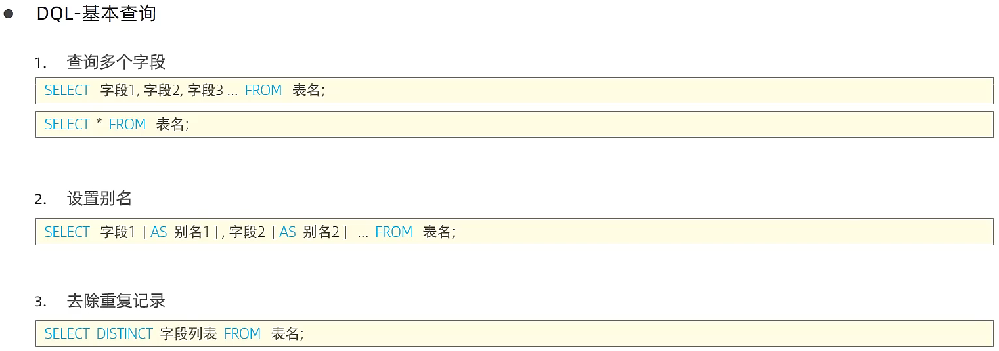
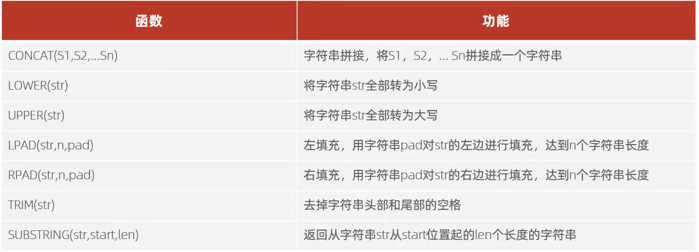

# MySQL

## 客服端连接

```java
mysql [-h 127.0.0.1][-P 3306] -u root -p
```

# DDL

（数据定义语言，用来定义数据库对象(数据库，表，字段）

## 数据库操作


```java
创建表
//需求：设计一张员工信息表，要求如下：
1.编号（纯数字）
2.员员工工号（字符串类型，长度不超过10位）
3.员工姓名（字符串类型，长度不超过10位）
4.性别（男/女，存储一个汉字）
5.年龄（正常人年龄，不可能存储负数）
6.身份证号（二代身份证号均为18位，身份证中有X这样的字符）
7.入职时间（取值年月日即可）
create table emp(
    -> id int comment '编号',
    -> workno varchar(10) comment '工号',
    -> name varchar(10) comment '姓名',
    -> gender char(1) comment '性别',
    -> age tinyint unsigned comment '年龄',
    -> idcard char(18) comment '身份证号',
    -> entrydate date comment '入职时间'
    -> ) comment '员工表';
```

## 表操作


```java
添加字段
mysql> alter table emp add nickname varchar(20) comment '昵称';
修改字段
mysql> alter table emp change nickname username varchar(30) comment '用户名';
删除字段
mysql> alter table emp drop username;
修改表名
mysql> alter table emp rename to employee; 
```


```java
删除表
mysql> drop table if exists tb_user;
删除指定表，并重新创建该表
mysql> truncate table employee;
```

## 小结


# DML

（数据操作语言，用来对数据库表中的数据进行增删改）

### 添加数据


```sql
1.给指定字段添加数据
insert into employee(id, workno, name, gender, age, idcard, entrydate) values (1,'1','Itcast','男',10,'123456789012345678','2000-01-01');
2.给全部字段添加数据
insert into employee values (2,'2','张无忌','男',18,'123456789012345670','2005-01-01');
3.批量添加数据
insert into employee values (2,'2','张无忌','男',18,'123456789012345670','2005-01-01'),(3,'3','韦一笑','男',38,'123455789012345670','2005-01-01');
```

### 修改数据


```sql
# 修改id为1的数据，将name修改为itheima
update employee set name = 'itheima' where id = 1;
# 修改id为1的数据，将name修改为小昭，gender修改为女
update employee set name = '小赵' ,gender = '女' where id = 1;
# 将所有的员工入职日期修改为2008-01-01
update employee set entrydate = '2008-01-01' ;
```

## 删除数据


```sql
-- 删除gender 为女的员工
delete from employee where gender = '女';
-- 删除所有员工
delete from employee;
```

# DQL

（数据查询语言，用来查询数据库中表的记录）

## 基本查询



```sql
-- 1. 查询指定字段 name，workno，age返回
select name,workno,age from emp;

-- 2．查询所有字段返回
select  id,workno,name,gender,age,idcard,workaddress,entrydate from emp;

select * from emp;
-- 3，查询所有员工的工作地址，起别名
select emp.workaddress as '工作地址' from emp;
select emp.workaddress '工作地址' from emp;

-- 4.查询公司员工的上班地址（不要重复）
select distinct emp.workaddress '工作地址' from emp;
```


## 条件查询

```sql
# 条件查询
# 1．查询年龄等于 88的员工
select  * from emp where age=88;
# 2．查询年龄小于20的员工信息
select * from emp where age < 20;
# 3．查询年龄小于等于20的员工信息
select * from emp where age < 20;
# 4．查询没有身份证好的员工信息
select  *from emp where idcard is null;
# 5．查询有身份证号的员工信息
select  *from emp where idcard is not null;
# 6，查询年龄不等于 88的员工信息
select * from emp where age != 88;
select * from emp where age <> 88;
# 7．查询年龄在15岁（包含）到20岁（包含）之间的员工信息
select * from emp where age >= 15 and age <= 20;
select * from emp where age between 15 and 20;
# 8．查询性别为女且年龄小于 25岁的员工信息
select * from emp where gender = '女' and age < 25;
# 9.查询年龄等于18或20或40的员工信息
select * from emp where age = 18 or age = 20 or age = 40;
select * from emp where age in(18,20,40);
# 10，查询姓名为两个字的员工信息  _ %
select * from emp where name like '__';
# 11.查询身份证号最后一位是X的员工信息
select * from emp where idcard like '%X';
```

```sql
-- 聚合函数
-- 1．统计该企业员工数量
select count(*) from emp;
select count(idcard) from emp;
-- 2．统计该企业员工的平均年龄
select avg(age) from emp;
-- 3．统计该企业员工的最大年龄
select max(age) from emp;
-- 4．统计该企业员工的最小年龄
select min(age) from emp;
-- 5.统计西安地区员工的年龄之和
select sum(age) from emp where workaddress = '西安';
```

## 分组查询


```sql
# 分组查询
# 1．根据性别分组，统计男性员工和女性员工的数量
select gender, count(*) from emp group by gender;
# 2．根据性别分组，统计男性员工和女性员工的平均年龄
select gender, avg(age) from emp group by gender;
# 3．查询年龄小于45的员工 ，并根据工作地址分组，获取员工数量大于等于3的工作地址
select workaddress, count(*) from emp where age < 45 group by workaddress having count(*) >= 3;
select workaddress, count(*) address_count from emp where age < 45 group by workaddress having address_count >= 3;
```

## 排序查询


```sql
# 排序查询
# 1.根据年龄对公司的员工进行升序排序
select * from emp order by age asc ;
select * from emp order by age desc ;
select * from emp order by age ;
# 2．根据入职时间，对员工进行降序排序
select * from emp order by  entrydate desc ;
# 3，根据年龄对公司的员工进行升序排序，年龄相同，再按照入职时间进行降序排序
select * from emp order by age asc ,entrydate desc ;
select * from emp order by age asc ,entrydate asc ;
```

## 分页查询


```sql
-- 分页查询
-- 1.查询第1页员工数据，每页展示10条记录
select * from emp limit 0,10;
select * from emp limit 10;
-- 2．查询第2页员工数据，每页展示10条记录  ----->(页码-1）* 页展示记录数
select * from emp limit 10,10;
```

```sql
-- --------------------- DQL 语句练习---------------------------

-- 1. 查询年龄为20,21,22,23岁的员工信息。
select * from emp where gender = '女' and age in(20,21,22,23);
-- 2．查询性别为男，并且年龄在20-40岁(含)以内的姓名为三个字的员工。
select * from emp where gender = '男' and ( age between 20 and 40 ) and name like '___';
-- 3．统计员工表中，年龄小于60岁的，男性员工和女性员工的人数。
select gender, count(*) from emp where age < 60 group by gender;
-- 4.查询所有年龄小于等于35岁员工的姓名和年龄，并对查询结果按年龄升序排序，如果年龄相同按入职时间降序排序。
select name,age  from emp where age < 35 order by age asc ,entrydate desc
-- 5．查询性别为男，且年龄在20-40岁(含)以内的前5个员工信息，对查询的结果按年龄升序排序，年龄相同按入职时间升序排序。
select * from emp where gender = '男' and age between 20 and 40 order by age asc ,entrydate desc  limit 5;
```

## DQL执行顺序


## 小结


# DCL

（数据控制语言，用来创建数据库用户、控制数据库的访问权限）

## 用户管理


```sql
-- 创建用户itcast，只能够在当前主机localhost访问，密码123456;
create user 'itcast'@'localhost' identified by '123456';
-- 创建用户heima，可以在任意主机访问该数据库，密码123456；
create user 'heima'@'%' identified by '123456';
-- 修改用户heima的访问密码为1234；
alter user 'heima'@'%' identified with mysql_native_password by '1234';
-- 删除itcast@localhost用户
drop user 'itcast'@'localhost';
```

## 权限控制


```sql
-- 查询权限
show grants for 'heima'@'%';

-- 授予权限
grant all on itcast.* to 'heima'@'%';

-- 撤销权限
revoke all on itcast.* from 'heima'@'%';
```

## 小结


# 函数

## 字符串函数



```sql
-- ------------------------函数演示---------------------------------
-- concat
select concat('Hello', ' MySQL');
-- lower
select lower('Hello');
-- lpad
select lpad('01',5,'-');
-- rpad
select rpad('01',5,'-');
-- trim
select trim(' Hello MySQL ');
-- substring
select substring('Hello MySQL ', 1,5);
-- 1．由于业务需求变更，企业员工的工号，统一为5位数，目前不足5位数的全部在前面补0。比如：1号员工的工号应该为00001。
update  emp set workno = lpad(workno,5,0);
```

## 数值函数


```sql
-- 2．通过数据库的函数，生成一个六位数的随机验证码。
select lpad(round(rand()*1000000 ,0), 6,'0');
```

## 日期函数


```sql
-- 3，查询所有员工的入职天数，并根据入职天数倒序排序。
select name, datediff(curdate(),entrydate) as 'entrydays' from emp order by entrydays desc ;
```

## 流程函数


```sql
--  案例：统计班级各个学员的成绩，展示的规则如下：
--  =85，展示优秀
--  >=60，展示及格
--  否则，展示不及格
select
    id,
    name,
    (case when math >= 85 then '优秀' when math >= 60 then '及格' else '不及格' end) '数学' ,
    (case when english >= 85 then '优秀' when english >= 60 then '及格' else '不及格' end) '英语',
    (case when chinese >= 85 then '优秀' when chinese >= 60 then '及格' else '不及格' end) '语文'
from score;
```

## 小结


# 约束

案例：


```sql
create table user(
    id int primary key auto_increment comment '主键',
    name varchar(10) not null unique comment '姓名',
    age int check ( age > 0 && age <= 120 ) comment '年龄',
    status char(1) default '1' comment '状态',
    gender char(1) comment '性别'
)comment '用户表';
-- 插入数据
insert  into user( name, age, status, gender) values ('Tom1',19,'1','男'),('Tom2',25,'0','男');
insert  into user( name, age, status, gender) values ('Tom3',39,'1','男');
insert  into user( name, age, status, gender) values ('Tom4',78,'1','男');
-- [23000][1048] Column 'name' cannot be null
insert  into user( name, age, status, gender) values (null,78,'1','男');
--  [HY000][3819] Check constraint 'user_chk_1' is violated.
insert  into user( name, age, status, gender) values ('Tom5',-1,'1','男');
insert  into user( name, age, status, gender) values ('Tom5',121,'1','男');
insert  into user( name, age, gender) values ('Tom5',120,'男');
```

## 外键约束


```sql
-- 添加外键
alter table emp add constraint fk_emp_dept_id foreign key (dept_id) references dept(id);

-- 删除外键
alter table emp drop foreign key fk_emp_dept_id; 
```


```sql
-- 外键的删除和更新行为
alter table emp add constraint fk_emp_dept_id foreign key (dept_id) references dept(id) on update  cascade  on delete  cascade ;
alter table emp add constraint fk_emp_dept_id foreign key (dept_id) references dept(id) on update  set null  on delete  set null ;
```

## 小结


# 多表查询

```sql
-- 多表查询
select * from emp ,dept where emp.dept_id = dept.id;
```


## 内连接

```sql
-- 内连接演示
-- 1，查询每一个员工的姓名，及关联的部门的名称（隐式内连接实现）
-- 表结构: emp , dept
-- 连接条件 emp.dept_id = dept.id
select emp.name ,dept.name from emp , dept where emp.dept_id = dept.id;
-- 给emp和dept分别取别名 e d
select  e.name, d.name from emp e ,dept d where e.dept_id = d.id;

-- 2、查询每一个员工的姓名，及关联的部门的名称（显式内连接实现） --- INNE JOIN ... ON ...
-- 表结构: emp , dept
-- 连接条件 emp.dept_id = dept.id
select e.name,d.name from emp e inner join dept d on e.dept_id = d.id;
```

## 外连接


```sql
-- 外连接演示
-- 1.查询emp表的断有数据，和对应的部门信息（左外连接）
-- 表结构: emp , dept
-- 连接条件 emp.dept_id = dept.id
select e.*, d.name from emp e left outer join dept d on e.dept_id = d.id;
select e.*, d.name from emp e left  join dept d on e.dept_id = d.id;
-- 2.查询dept表的所有数据，和对应的员工信息（右外连接）
select d.*, e.* from emp e right  outer join dept d on e.dept_id = d.id;
```

## 自连接


```sql
-- 自连接
-- 1．查询员工及其所属领导的名字
-- 表结构： emp
select a.name , b.name from emp a ,emp b where a.managerid = b.id;
-- 2．查询所有员工emp及其领导的名字emp，如果员工没有领导，也需要查询出来
-- 表结构： emp a ,emp b
select a.name '员工' , b.name '领导' from emp a left join emp b on a.managerid = b.id;
```

## 联合查询 union


```sql
-- union all,union
-- 1，将薪资低于5000的员工，和年龄大于50岁的员工全部查询出来。
select * from emp where salary < 5000
union all
select * from emp where age >50 ;
-- 删掉all 可以达到去重的效果
select * from emp where salary < 5000
union
select * from emp where age >50;
```

## 子查询


### 标量子查询


```sql
-- 标量子查询
-- 1．查询『销售部"的所有员工信息
-- a. 查询“销售部” 部门的ID
select id from dept where name = '销售部';
-- b.根据销售部部门ID，查询员工信息
select * from emp where dept_id = (select id from dept where name = '销售部');

-- 2．查询在"方东白"入职之后的员工信息
-- a，查询方东白的入职日期
select entrydate from emp where name = '方东白';
-- b，查询指定入职日期之后入职的员工信息
select * from emp where entrydate > (select entrydate from emp where name = '方东白');
```

### 列子查询


```sql
-- 列子查询
-- 1．查询"销售部"和"市场部"的所有员工信息
-- a.查询"销售部"和"市场部"的部门ID
select id from dept where name = '销售部' or name = '市场部';
-- b.根据部门ID，查询员工信息
select * from emp where dept_id in (select id from dept where name = '销售部' or name = '市场部');
-- 2，查询比财务部所有人工资都高的员工信息
-- a.查询所有财务部人员工资
select id from dept where name = '财务部';
select emp.salary from emp where dept_id = (select id from dept where name = '财务部');
-- b.比财务部所有人工资都高的员工信息
select  * from emp where salary > all (select salary from emp where dept_id = (select id from dept where name = '财务部'));

-- 3，查询比研发部其中任意一人工资高的员工信息
-- α，查询研发部所有人工资
select id from dept where name = '研发部';
select emp.salary from emp where dept_id = (select id from dept where name = '研发部');
-- b，比研发部其中任意一人工资高的员工信息
select * from emp where salary > any (select emp.salary from emp where dept_id = (select id from dept where name = '研发部'));
select * from emp where salary > some (select emp.salary from emp where dept_id = (select id from dept where name = '研发部'));
-- 查询比研发部最高工资还要高的员工信息
-- 研发部最高工资
select max(salary) from emp where dept_id = (select id from dept where name = '研发部');
select * from emp where salary > all (select max(salary) from emp where dept_id = (select id from dept where name = '研发部'));
```

### 行子查询


```sql
-- 行子查询
-- 1．查询与"张无忌"的薪资及直属领导相同的员工信息；
-- α．查询"张无忌"的薪资及直属领导
select salary , managerid from emp where name = '张无忌';
-- b，查询与"张无忌"的薪资及直属领导相同的员工信息；
select * from emp where (salary , managerid) = (select salary , managerid from emp where name = '张无忌');
```

### 表子查询


```sql
-- 表子查询
-- 1.查询与"鹿杖客"，"宋远桥"的职位和薪资相同的员工信息
-- α.查询"鹿杖客"，"宋远桥"的职位和薪资
select job,salary from emp where name = '鹿杖客' or name = '宋远桥';
-- b．查询与"鹿杖客"，"宋远桥"的职位和薪资相同的员工信息
select * from emp where (job, salary) in (select job,salary from emp where name = '鹿杖客' or name = '宋远桥');
-- 2．查询入职日期是"2006-01-01"之后的员工信息，及其部门信息
select * from emp where entrydate > '2006-01-01';
select e.*,d.name from (select * from emp where entrydate > '2006-01-01') e left join dept d on e.dept_id = d.id ;
```

练习

```sql
-- 1.查询员工的姓名、年龄、职位、部门信息。（隐式内连接）
-- 表:emp，dept
-- 连接条件:emp.dept_id =dept.id
select e.name, e.age, e.job, d.name from emp e, dept d where e.dept_id = d.id;
-- 2、查询年龄小于30岁的员工姓名、年龄、职位、部门信息。（显式内连接）
-- 表:emp，dept
-- 连接条件：emp.dept_id=dept.id
select e.name, e.age, e.job, d.name from emp e inner join dept d on e.dept_id = d.id where e.age < 30;
3.查询拥有员工的部门ID、部门名称。
4.查询所有年龄大于40岁的员工，及其归属的部门名称；如果员工没有分配部门，也需要展示出来。
5.查询所有员工的工资等级。
6.查询"研发部"所有员工的信息及工资等级。
7.查询“研发部”员工的平均工资。
8.查询工资比"灭绝"高的员工信息。
9.查询比平均薪资高的员工信息。
10.查询低于本部门平均工资的员工信息。
11．查询所有的部门信息，并统计部门的员工人数。
12.查询所有学生的选课情况，展示出学生名称，学号，课程名称


```

# 事务

## 四大特性


