# java

## 1.Scanner

作用：键盘输入数据

```java
import java.util.Scanner;

#从键盘输入数据
Scanner sc = new Scanner(System.in);
int num = sc.nextInt();
```

## 2. Random

作用：生成随机数

```java
import java.util.Random;

#得到0-9的随机数
Random r = new Random();
int number = r.nextInt(10); # nextInt(n)只能生成0-n-1的数，不包含n  
```

## 3.数组

```java
静态初始化
#完整格式
数据类型[] 数据名 = new 数据类型[]{元素1,元素2...}
int[] ages = new int[]{12,23,44};
#简化格式
数据类型[] 数据名 = {元素1,元素2...}
int[] ages = {22,34,44};


动态初始化
数据类型[] 数组名 = new 数据类型[长度];
int[] ages = new int[3];
```

## 4.方法

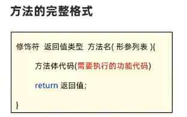

```java
public static int sum(int a,int b){
    int c = a + b;
    return c;
}
```

## 4.this

```java
# this就是一个变量，可以在方法中使用，来拿到当前对象。
应用场景：解决变量名称冲突问题
```

## 5.构造器

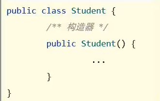

## 6.实体javaBean

```java
# 特殊的实体类
  要求：1.这个类的成员变量都要私有，并对外提供get、set方法
       2.类中必须要有一个公共的无参的构造器
```

## 7.API

### 包

```java
// 1.同一个包下的程序可以直接访问
        Demo d = new Demo();
        d.print();    
// 2.访问其他包下的程序，必须导包才可以访问            
import com.thisdemo.Demo1;
        Demo1 d1 = new Demo1();
        d1.print();
// 3.自己的程序中调用java提供的程序，也需要先导包才可以使用；注意：Java.lang包下的程序是不需要我们导包的，可以直接使用
import java.util.Random;
import java.util.Scanner;
        Scanner sc = new Scanner(System.in);
        String string = "hhhhhh";
        Random r = new Random();
//4.访问多个其他包下的程序，这些程序名又一样的情况下，默认只能导入一个程序，
//  另一个程序必须带包名和类名来访问
        Demo2 d3 = new Demo2();
        d3.print();
        com.thisdemo.Demo2 d4 = new com.thisdemo.Demo2();
        d4.print();
```

## 8.String

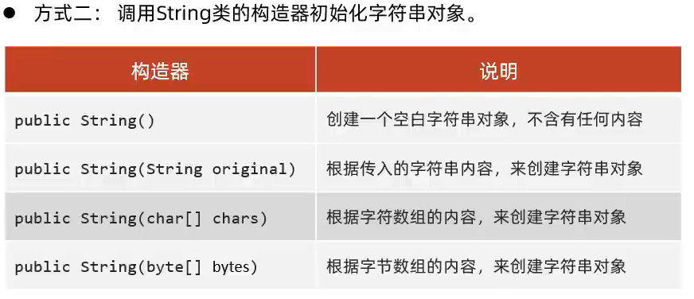

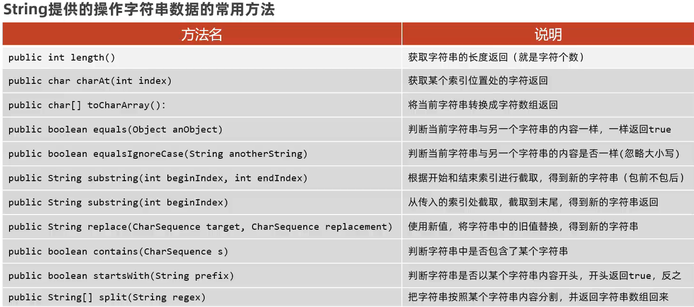

## 9.ArrayList

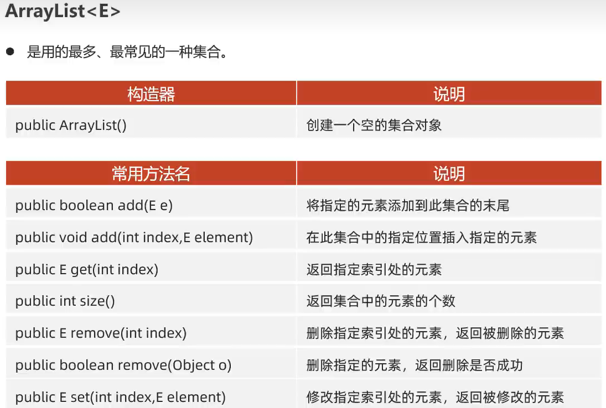

## 10.增强的for循环（for-each）

```java
for (元素类型 变量名 : 集合或数组) {
    // 循环体
}
示例:
int[] nums = {1, 2, 3, 4, 5};
for (int num : nums) {
    System.out.println(num);
}
输出：1 2 3 4 5
```

## 11.哈希表

**`HashSet`**：

- 只存储唯一的值（元素），没有键值对。
  
  ```java
  HashSet<String> set = new HashSet<>();
  ```

**`HashMap`**：

- 存储键值对，键和值都可以是任意类型（引用类型）。

- 键是唯一的，值可以重复。

```java
Map<Integer, Integer> map = new HashMap<>();
Map<Integer, Integer>：声明一个 Map 类型的变量，键和值都是 Integer 类型。
键（Key）：元素的唯一标识（如数组下标、元素值等）。
值（Value）：与键关联的数据（如元素的下标、出现次数等）
```

### 常用方法

- **`HashMap`**：
  
  - `put(key, value)`：添加键值对。
  
  - `get(key)`：根据键获取值。
  
  - `containsKey(key)`：检查是否包含某个键。
  
  - `keySet()`：获取所有键的集合。
  
  - `values()`：获取所有值的集合。

- **`HashSet`**：
  
  - `add(element)`：添加元素。
  
  - `remove(element)`：删除元素。
  
  - `contains(element)`：检查是否包含某个元素。
  
  - `size()`：获取集合的大小。

| 特性    | `HashMap<K, V>`      | `HashSet<E>`    |
| ----- | -------------------- | --------------- |
| 存储内容  | 键值对（key-value pairs） | 唯一的值（元素）        |
| 键的唯一性 | 键唯一，值可以重复            | 值唯一             |
| 底层实现  | 哈希表                  | 基于 `HashMap` 实现 |
| 适用场景  | 需要通过键快速查找值           | 需要存储唯一值并快速检查存在性 |

## 12.static

```java
类变量：有static修饰，属于类，在计算机里只有一份，会被类的全部对象共享
实例变量（对象的变量）：无static修饰，属于每个对象

//静态代码块
格式：static{}
特点：内加载时自动执行，由于内阻会加载一次，所以静态代码块也只会执行一次。
作用：完成类的初始化，例如：类变量的初始化赋值。

//实例代码块
格式：{}
特点：每次创建对象时执行实例代码块，并在构造器前执行。
作用：和构造器一样，都是用来完成对象的处事方。例如对实例变量进行初始化赋值。


//单例设计模式
确保一个类只有一个对象
写法：    把类的构造器私有化
         定义一个类变量记住类的一个对象
         定义一个类方法，返回对象
```

## 13.多态

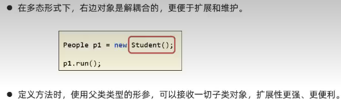

```java
自动类型转换：父类 变量名 = new 子类();  People p = new Teacher();
强制类型转换：父类 变量名 = (子类)父类变量; Teacher t = (Teacher)p; 
```

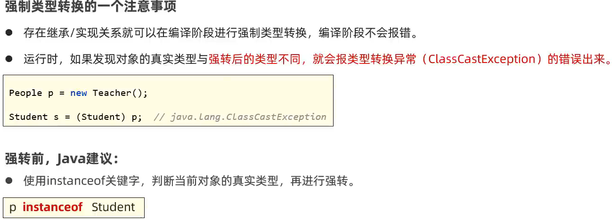

## 14.final

###### final关键字是最终的意思，可以修饰(类、方法、变量)

- 修饰类:该类被称为最终类，特点是不能被继承了

- 修饰方法:该方法被称为最终方法，特点是不能被重写了。

- 修饰变量:该变量只能被赋值一次。

###### final修饰变量的注意

- final修饰基本类型的变量，变量存储的数据不能被改变。

- final修饰引用类型的变量，变量存储的地址不能被改变，
  但地址所指向对象的内容是可以被改变的。

## 15.常量

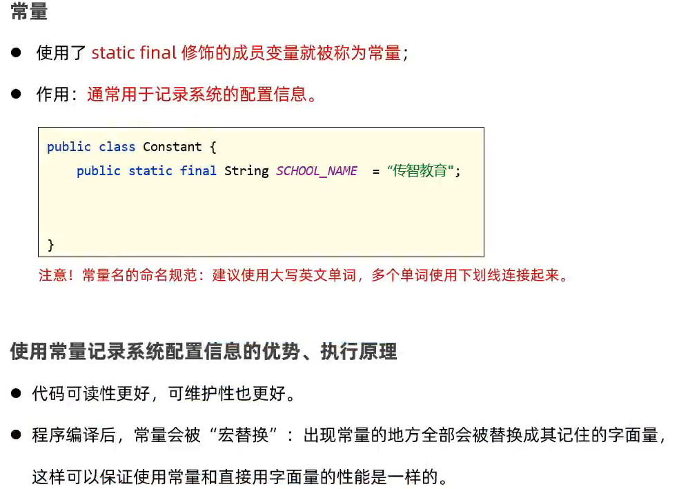

## 16.抽象类（abstract)

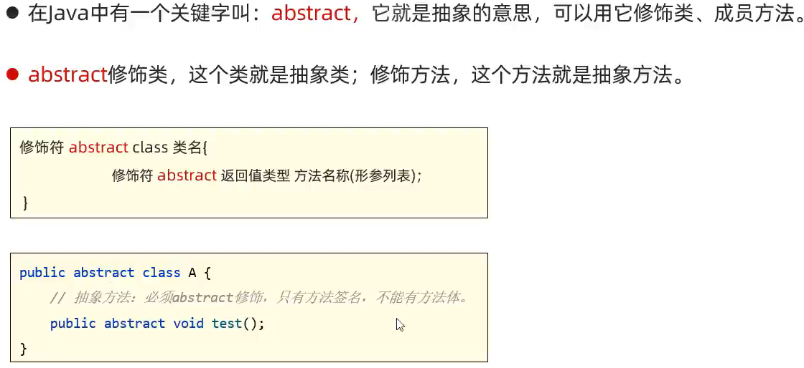

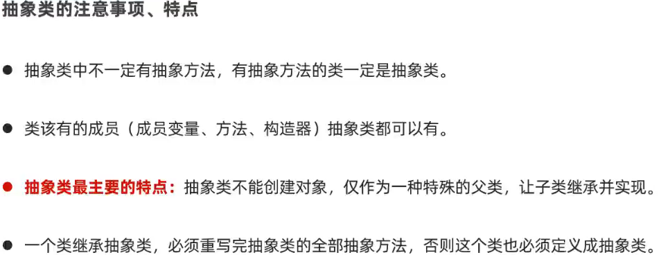

## 17.接口

```java
public interface 接口名{
    // 成员变量（常量）
    // 成员方法（抽象方法）
}
// 接口的好处：
// 弥补了类单继承的不足，一个类可以实现多个接口
// 让程序可以面向接口编程，这样程序员就可以灵活方便的切换各种业务的实现。
```

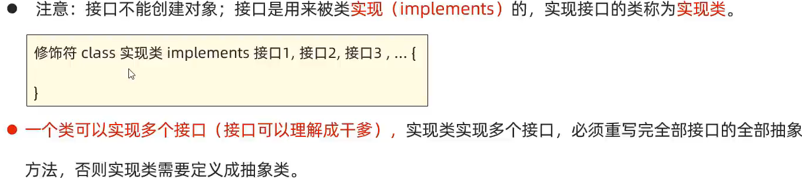

### 18.API

#### Object

#### Objects
