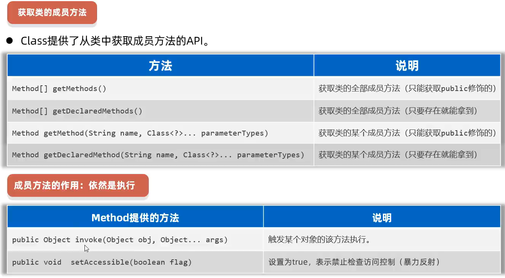

# java

## 1.Scanner

作用：键盘输入数据

```java
import java.util.Scanner;

#从键盘输入数据
Scanner sc = new Scanner(System.in);
int num = sc.nextInt();
```

## 2. Random

作用：生成随机数

```java
import java.util.Random;

#得到0-9的随机数
Random r = new Random();
int number = r.nextInt(10); # nextInt(n)只能生成0-n-1的数，不包含n  
```

## 3.数组

```java
静态初始化
#完整格式
数据类型[] 数据名 = new 数据类型[]{元素1,元素2...}
int[] ages = new int[]{12,23,44};
#简化格式
数据类型[] 数据名 = {元素1,元素2...}
int[] ages = {22,34,44};


动态初始化
数据类型[] 数组名 = new 数据类型[长度];
int[] ages = new int[3];
```

## 4.方法


```java
public static int sum(int a,int b){
    int c = a + b;
    return c;
}
```

## 4.this

```java
# this就是一个变量，可以在方法中使用，来拿到当前对象。
应用场景：解决变量名称冲突问题
```

## 5.构造器


## 6.实体javaBean

```java
# 特殊的实体类
  要求：1.这个类的成员变量都要私有，并对外提供get、set方法
       2.类中必须要有一个公共的无参的构造器
```

## 7.API

### 包

```java
// 1.同一个包下的程序可以直接访问
        Demo d = new Demo();
        d.print();    
// 2.访问其他包下的程序，必须导包才可以访问            
import com.thisdemo.Demo1;
        Demo1 d1 = new Demo1();
        d1.print();
// 3.自己的程序中调用java提供的程序，也需要先导包才可以使用；注意：Java.lang包下的程序是不需要我们导包的，可以直接使用
import java.util.Random;
import java.util.Scanner;
        Scanner sc = new Scanner(System.in);
        String string = "hhhhhh";
        Random r = new Random();
//4.访问多个其他包下的程序，这些程序名又一样的情况下，默认只能导入一个程序，
//  另一个程序必须带包名和类名来访问
        Demo2 d3 = new Demo2();
        d3.print();
        com.thisdemo.Demo2 d4 = new com.thisdemo.Demo2();
        d4.print();
```

## 8.String


## 9.ArrayList


## 10.增强的for循环（for-each）

```java
for (元素类型 变量名 : 集合或数组) {
    // 循环体
}
示例:
int[] nums = {1, 2, 3, 4, 5};
for (int num : nums) {
    System.out.println(num);
}
输出：1 2 3 4 5
```

## 11.哈希表

**`HashSet`**：

- 只存储唯一的值（元素），没有键值对。
  
  ```java
  HashSet<String> set = new HashSet<>();
  ```

**`HashMap`**：

- 存储键值对，键和值都可以是任意类型（引用类型）。

- 键是唯一的，值可以重复。

```java
Map<Integer, Integer> map = new HashMap<>();
Map<Integer, Integer>：声明一个 Map 类型的变量，键和值都是 Integer 类型。
键（Key）：元素的唯一标识（如数组下标、元素值等）。
值（Value）：与键关联的数据（如元素的下标、出现次数等）
```

### 常用方法

- **`HashMap`**：
  
  - `put(key, value)`：添加键值对。
  
  - `get(key)`：根据键获取值。
  
  - `containsKey(key)`：检查是否包含某个键。
  
  - `keySet()`：获取所有键的集合。
  
  - `values()`：获取所有值的集合。

- **`HashSet`**：
  
  - `add(element)`：添加元素。
  
  - `remove(element)`：删除元素。
  
  - `contains(element)`：检查是否包含某个元素。
  
  - `size()`：获取集合的大小。

| 特性    | `HashMap<K, V>`      | `HashSet<E>`    |
| ----- | -------------------- | --------------- |
| 存储内容  | 键值对（key-value pairs） | 唯一的值（元素）        |
| 键的唯一性 | 键唯一，值可以重复            | 值唯一             |
| 底层实现  | 哈希表                  | 基于 `HashMap` 实现 |
| 适用场景  | 需要通过键快速查找值           | 需要存储唯一值并快速检查存在性 |

## 12.static

```java
类变量：有static修饰，属于类，在计算机里只有一份，会被类的全部对象共享
实例变量（对象的变量）：无static修饰，属于每个对象

//静态代码块
格式：static{}
特点：内加载时自动执行，由于内阻会加载一次，所以静态代码块也只会执行一次。
作用：完成类的初始化，例如：类变量的初始化赋值。

//实例代码块
格式：{}
特点：每次创建对象时执行实例代码块，并在构造器前执行。
作用：和构造器一样，都是用来完成对象的处事方。例如对实例变量进行初始化赋值。


//单例设计模式
确保一个类只有一个对象
写法：    把类的构造器私有化
         定义一个类变量记住类的一个对象
         定义一个类方法，返回对象
```

## 13.多态


```java
自动类型转换：父类 变量名 = new 子类();  People p = new Teacher();
强制类型转换：父类 变量名 = (子类)父类变量; Teacher t = (Teacher)p; 
```


## 14.final

###### final关键字是最终的意思，可以修饰(类、方法、变量)

- 修饰类:该类被称为最终类，特点是不能被继承了

- 修饰方法:该方法被称为最终方法，特点是不能被重写了。

- 修饰变量:该变量只能被赋值一次。

###### final修饰变量的注意

- final修饰基本类型的变量，变量存储的数据不能被改变。

- final修饰引用类型的变量，变量存储的地址不能被改变，
  但地址所指向对象的内容是可以被改变的。

## 15.常量


## 16.抽象类（abstract)


## 17.接口

```java
public interface 接口名{
    // 成员变量（常量）
    // 成员方法（抽象方法）
}
// 接口的好处：
// 弥补了类单继承的不足，一个类可以实现多个接口
// 让程序可以面向接口编程，这样程序员就可以灵活方便的切换各种业务的实现。
```


### 18.枚举（Enumeration）

是一种特殊的数据类型，用于定义一组​**​命名的常量集合​**​。


# 泛型


# API

## BigDecimal

- 用于解决浮点型运算时，出现结果失真的问题

## Data

构造器：

- **public Date()** 创建一个Date对象，代表的是系统当前此刻日期时间。

- **public Date(long time)** 把时间毫秒值转换成Date日期对象。

常见方法

- **public long getTime()** 返回从1970年1月1日00:00:00走到此刻的总的毫秒数

- **public void setTime(long time)** 设置日期对象的时间为当前时间毫秒值对应的时间。


- **public Date parse(String source)** 把字符串时间解析成日期时间

### Calendar

- **public static Calendar getInstance()**     获取当前日历对象

- **public int get(int field)**  获取日历中的某个信息

- **public final Date getTime()** 获取日期对象

- **public long getTimeInMillis()** 获取时间毫秒值

- **public void set(int field,int value)**  修改日历的某个信息

- **public void add(int field,int amount)**  为某个信息增加/减少指定的值

## JDK8_Time


### LocalDate


### LocalTime


### LocalDateTime


### ZoneId


### DateTimeFormatter

- **public static DateTimeFormatter ofPatten(时间格式)**      获取格式化器对象

- **public String format(时间对象)**    格式化时间

### Period


### Duration


### Arrays


### Lambda表达式


### 方法引用

#### 静态方法的引用

- **类名::静态方法**    
  
  使用场景：如果某个Lambda表达式里只是调用一个静态方法，并且前后参数的形式一致，就可以使用静态方法引用。

#### 实例方法的引用

- **对象名:实例方法**    
  
  使用场景：如果某个Lambda表达式里只是调用一个实例方法，并且前后参数的形式一致，就可以使用实例方法引用

#### 特定类型的方法引用

- **类型:方法**    
  
  使用场景：如果某个Lambda表达式里只是调用一个实例方法，并且前面参数列表中的第一个参数是作为方法的主调，后面的所有参数都是作为该实例方法的入参的，则此时就可以使用特定类型的方法引用。  

## 正则表达式


## 异常

**运行时异常**：RuntimeException及其子类，编译阶段不会出现错误提醒，运行时出现的异常（如：数组索引|趣界异常）
**编译时异常**：编译阶段就会出现错误提醒的。（如：日期解析异常）

### 抛出异常（throws）

在方法上使用throws关键字，可以将方法内部出现的异常抛出去给调用者处理。

```java
方法 throws 异常1 异常2 异常3..{
    ...
}
```

### 捕获异常（try...catch)

直接捕获程序出现的异常

```java
try{
    // 监视可能出现异常的代码
}catch(异常类型1 变量){
    // 处理异常
}catch(异常类型2 变量){
    // 处理异常
}
```


# 集合

## 单列集合  Collection


### 迭代器

```java
Collection<String> c = new ArrayList<>();
        c.add("小米");
        c.add("上课");
// 1、从集合对象中获取迭代器对象
        Iterator<String> it = c.iterator();
// 2、使用循环结合迭代器遍历
        while (it.hasNext()) {
            String ele = it.next();
            System.out.println(ele);
        }
```

### 增强for循环

```java
for (元素的数据类型 变量名:数组或者集合){...}
```

## List


### LinkedList

## Set

### TreeSet


```java
方法一： 
public class Student implements Comparable<Student> {
     // this o  
    @Override
    public int compareTo(Student o) {
        return this.age - o.age;  // 按年龄升序排序
    }
}
方法二：
 Set<Student> students = new TreeSet<>(new Comparator<Student>() {
            @Override
            public int compare(Student o1, Student o2) {
                // 按照升高升序排序
                return Double.compare(o1.getHeight(), o2.getHeight());
            }
        });
```

### 小结


## Collections

用来操作集合的工具类


## 双列集合 Map


### 常用方法


### Lambda遍历Map

```java
map.forEach((k,v)->{
    System.sout.println(k + "-->" + v );
});
```

## Stream

- Jdk8开始新增的API，用于操作集合或者数组中的数据。


```java
1、获取stream流
//1、如何获取List集合的Stream流？
        List<String> names = new ArrayList<>();                
        Stream<String> stream = names.stream();
//2、如何获取Set集合的Stream流？
        Set<String> set = new HashSet<>();
        Stream<String> stream1 = set.stream();
//3、如何获取Map集合的Stream流？
        Set<Map.Entry<String, Double>> entries = map.entrySet();
        Stream<Map.Entry<String, Double>> kvs = entries.stream();
//4、如何获取数组的stream流？
        Stream<String> s1 = Arrays.stream(names2);
2、Stream流常见的中间方法
 - 中间方法: 指的是调用完成后会返回新的Stream流，可以继续使用(支持链式编程)。
//需求2：找出年龄大于等于23，且年龄小于等于30岁的学生，并按照年龄降序输出。
        students.stream().filter(s -> s.getAge() >= 23 && s.getAge() <= 30)
                .sorted((o1, o2) -> o2.getAge() - o1.getAge())   // 此时的 s 过滤完 直接sorted它不知道要怎么排序，在Students重写compareTo ，或者在sorted重写
                .forEach(s -> System.out.println(s));
//需求3：取出身高最高的前3名学生，并输出。
        students.stream().sorted(((o1, o2) -> Double.compare(o1.getHeight(), o2.getHeight())))
                .limit(3).forEach(s -> System.out.println(s));
//需求5：找出身高超过168的学生叫什么名字，要求去除重复的名字，再输出。
        students.stream().filter(s -> s.getHeight() > 168)
                .map(s -> s.getName()) // 把过滤好的映射成为他的名字
                .distinct()  // 去重 ,自定义类型的对象（希望内容一样就认为重复，需要重写hashCode，equals）
                .forEach(s -> System.out.println(s));
3、Stream流常见的终结方法
```

# File

## 创建File类对象


## 遍历文件夹


# IO流


## Commons-io


# xml

应用场景：经常用来做为系统的配置文件；或者作为一种特殊的数据结构，在网络中进行传输。


# Logback （日志）


```java
使用Logback日志框架，记录系统的运行信息
// 创建一个Logger日志对象
    public static final Logger LOGGER = LoggerFactory.getLogger("LogBackTest");
// 记录日志的执行流程
LOGGER.info("chu法方法开始执行~~~");
```


## 日志级别 （升序）

                     **trace**    <     **debug**    <     **info**     <     **warn**    <     **error**


# 多线程

    **java通过java.lang.Thread类的对象来代表线程。**

## 多线程的创建方式

```java
方法一： 继承Thread类
   1、定义一个子类MyThread继承线程类java.lang.Thread,重写run()方法
   2、创建MyThread类的对象
   3、调用线程对象的start()方法启动线程（启动后还是执行run方法的）

方法二：实现Runnable接口
    1、定义一个线程任务类MyRunnable实现Runnable接口，重写run()方法
    2、创建MyRunnable任务对象
    3、把MyRunnable任务对象交给Thread处理。
优点：任务类只是实现接口，可以继续继承其他类、实现其他接口，扩展性强。
缺点：需要多一个Runnable对象。


```

### 方法三：实现Callable接口


## Thread 常用方法


## 线程同步

### 1、同步代码块

- 作用：把访问共享资源的核心代码给上锁，以此保证线程安全。

- 原理：每次只允许一个线程加锁后进入，执行完毕后自动解锁，其他线程才可以进来执行。

```java
synchronized(同步锁){访问共享资源的核心代码}
锁对象的使用规范：
    - 建议使用共享资源作为锁对象，对于实例方法建议使用this作为锁对象。
    - 对于静态方法建议使用字节码（类名.class）对象作为锁对象。
```

### 2、同步方法

- 作用：把访问共享资源的核心方法给上锁，以此保证线程安全。

- 原理：每次只能一个线程进入，执行完毕以后自动解锁，其他线程才可以进来执行。

```java
修饰符 synchronized 返回值类型  方法名称(形参列表){ 操作共享资源的代码 }
```

### 3、Lock锁

Lock是接口，不能直接实例化，可以采用它的实现类ReentrantLock来构建Lock锁对象。

```java
private final Lock lk = new ReentrantLock();
lk.lock();  // 加锁
lk.unlock();  // 解锁
```

## 线程池


# 网络通信


## UDP

```java
 ---------------------------------- UDP --------------------------------
Client(客服端)：
//1、创建客户端对象（发韭菜出去的人）
DatagramSocket socket = new DatagramSocket();
//2、创建数据包对象封装要发出去的数据（创建一个韭菜盘子）
     参数一：封装要发出去的数据。
     参数二：发送出去的数据大小（字节个数）
     参数三：服务端的IP地址（找到服务端主机）
     参数四：服务端程序的端口。
DatagramPacket packet = new DatagramPacket(bytes, bytes.length
                    ,InetAddress.getLocalHost(), 6666);
//3、开始正式发送这个数据包的数据出去了
            socket.send(packet);
 Server（服务端）：
//1、创建一个服务端对象（创建一个接非菜的人）注册端口
        DatagramSocket socket = new DatagramSocket(6666);
//2、创建一个数据包对象，用于接收数据的（创建一个非菜盘子）
        byte[] buffer = new byte[1024 * 64]; // 64KB.
        DatagramPacket packet = new DatagramPacket(buffer, buffer.length); 
//3、开始正式使用数据包来接收客户端发来的数据
            socket.receive(packet);
```

## TCP


```java
---------------------------------TCP-------------------------------------
服务端实现步骤
①创建ServerSocket对象，注册服务端端口。
②调用ServerSocket对象的accept()方法，等待客户端的连接，并得到Socket管道对象。
③通过Socket对象调用getlnputStream()方法得到字节输入流、完成数据的接收。
④释放资源：关闭socket管道

```

# 单元测试

## Junit 单元测试

具体步骤：

- 将Junit框架的jar包导入到项目中（注意：IDEA集成了Junit框架，不需要我们自己手工导入了）

- 为需要测试的业务类，定义对应的测试类，并为每个业务方法，编写对应的测试方法（必须：公共、无参、无返回值）

- 测试方法上必须声明@Test注解，然后在测试方法中，编写代码调用被测试的业务方法进行测试；

- 开始测试：选中测试方法，右键选择“JUnit运行”，如果测试通过则是绿色；如果测试失败，则是红色

# 反射

**作用：** 

- 可以得到一个类的全部成分然后操作

- 可以破坏封装性

- 【核心】：做java的框架，基于反射设计出一些通用功能

## 1、获取Class对象

获取Class对象的三种方式  

* Class c1 =类名.class  
* 调用Class提供方法:public static Class forName(String package);  
* Object提供的方法: public Class getClass(); Class c3 =对象.getclass()

## 2、获取类的构造器


## 3、获取类的成员变量


## 4、获取类的成员方法



# 自定义注解

```java
public @interface 注解名称{
    public 属性类型 属性名() default 默认值;
}
```
