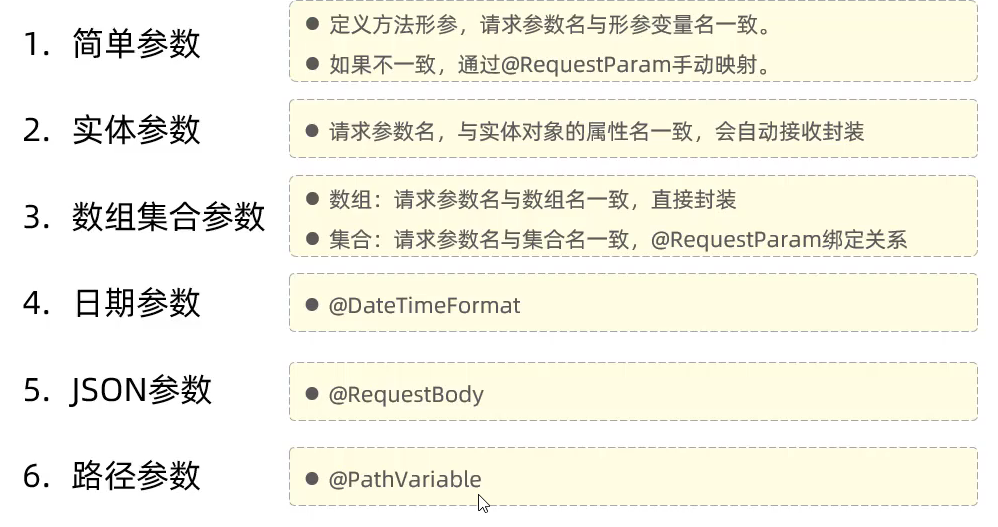
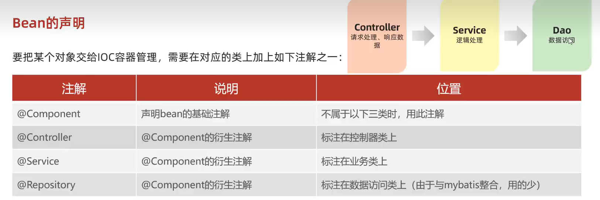

# Maven

## 生命周期

- clean ：清理

- compile ：编译

- test ：测试

- package ：打包

- Install ：安装

# 请求参数

# springboot

- 起步依赖：就是maven的依赖传递

- 自动配置：

| 注解              | 作用              | 示例            |
| --------------- | --------------- | ------------- |
| `@RequestParam` | 从 URL 查询参数获取值   | `?name=John`  |
| `@PathVariable` | 从 URL 路径获取值     | `/users/{id}` |
| `@RequestBody`  | 从请求体获取 JSON/XML | POST 请求体      |
