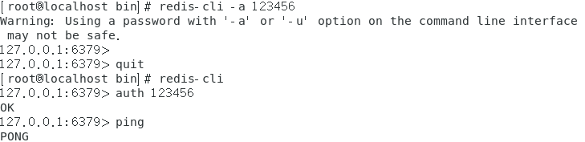
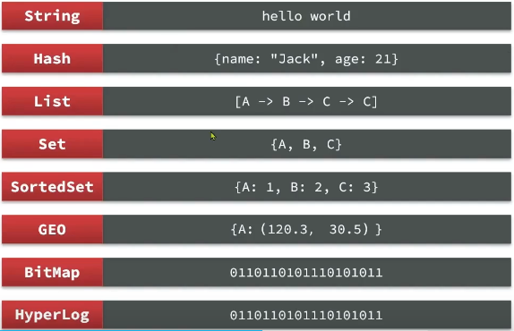

### 关键排查命令总结

| 命令                                               | 作用       |
| ------------------------------------------------ | -------- |
| `journalctl -u redis -xe`                        | 查看完整错误日志 |
| `sudo -u redis redis-server /path/to/redis.conf` | 手动测试启动   |
| `ls -l /usr/local/src/redis-6.2.14/`             | 检查文件权限   |
| `netstat -tulnp \| grep 6379`                    | 检查端口占用   |

# Redis 命令行客户端

```shell
redis-cli [options] [commonds]
```

其中常见的options有：

- `-h 127.0.0.1`：指定要连接的redis节点的IP地址，默认是127.0.0.1
- `-p 6379`：指定要连接的redis节点的端口，默认是6379
- `-a 123321`：指定redis的访问密码

其中的commonds就是Redis的操作命令，例如：

- `ping`：与redis服务端做心跳测试，服务端正常会返回`pong`

不指定commond时，会进入`redis-cli`的交互控制台：



# Redis 通用命令

- **KYES**：查看符合模板的所有key，不建议子啊生产环境设备上使用。

- **DEL**：删除一个指定的key。

- **EXISTS**：判断key是否存在

- **EXPIRE**：给一个key设置有效期，有效期到期时该key会被自动删除。

通过 **help [command]**  可以查看一个命令的具体用法。

```shell
127.0.0.1:6379> help EXISTS
  EXISTS key [key ...]
  summary: Determine if a key exists
  since: 1.0.0
  group: generic
```

# Redis 数据结构



[reids命令](https://redis.io/commands)

# Redis数据类型

## 基本类型

### String

● ​**​SET​**​：添加或者修改已经存在的一个String类型的键值对

● ​**​GET​**​：根据key获取String类型的value

● ​**​MSET​**​：批量添加多个String类型的键值对

● ​**​MGET​**​：根据多个key获取多个String类型的value

● ​**​INCR​**​：让一个整型的key自增1

● ​**​INCRBY​**​：让一个整型的key自增并指定步长，例如：`INCRBY num 2` 让num值自增2

● ​**​INCRBYFLOAT​**​：让一个浮点类型的数字自增并指定步长

● ​**​SETNX​**​：添加一个String类型的键值对，前提是这个key不存在，否则不执行

● ​**​SETEX​**​:添加一个String类型的键值对，并且指定有效期

**Redis**的**key**的格式：**[项目名]:[业务名]:[类型]:id**    

```shell
set heima:product:1 '{"id":1, "name":"小米11", "price": 4999}'
```

### Hash

● ​**​HSET key field value​**​：添加或者修改hash类型key的field的值

● ​**​HGET key field​**​：获取一个hash类型key的field的值

● ​**​HMSET​**​：批量添加多个hash类型key的field的值

● ​**​HMGET​**​ ：批量获取多个hash类型key的field的值

● ​**​HGETALL​**​：获取一个hash类型的key中的所有的field和value

● ​**​HKEYS​**​：获取一个hash类型的key中的所有的field

● ​**​HVALS​**​：获取一个hash类型的key中的所有的value

● ​**​HINCRBY​**​：让一个hash类型key的字段值自增并指定步长

● ​**​HSETNX​**​：添加一个hash类型的key的field值，前提是这个field不存在，否则不执行

### List

● ​**​LPUSH key element [element...]​**​：向列表左侧插入一个或多个元素

● ​**​RPUSH key element [element...]​**​ ：向列表右侧插入一个或多个元素

● ​**​LPOP key​**​：移除并返回列表左侧的第一个元素，没有则返回nil

● ​**​RPOP key​**​：移除并返回列表右侧的第一个元素

● ​**​LRANGE key start end​**​：返回指定索引范围内的所有元素  
（start和end为索引下标，0表示第一个元素，-1表示最后一个元素）

● ​**​BLPOP key [key...] timeout​**​：阻塞式左弹出，当列表为空时等待指定秒数  
（timeout为0表示无限等待）

● ​**​BRPOP key [key...] timeout​**​：阻塞式右弹出，当列表为空时等待指定秒数

### Set

● ​**​SADD key member [member...]​**​：向set集合中添加一个或多个元素

● ​**​SREM key member [member...]​**​：从set集合中移除指定的元素

● ​**​SCARD key​**​：获取set集合中元素的数量

● ​**​SISMEMBER key member​**​：判断指定元素是否存在于set集合中  
（存在返回1，不存在返回0）

● ​**​SMEMBERS key​**​：获取set集合中的所有元素

● ​**​SINTER key [key...]​**​：返回给定所有集合的交集  `示例：SINTER set1 set2`

● ​**​SDIFF key [key...]​**​：返回第一个集合与其他集合的差集  `示例：SDIFF set1 set2`

● ​**​SUNION key [key...]​**​：返回所有给定集合的并集  `示例：SUNION set1 set2`

```shell
需求：
1.将下列数据用Redis的Set集合来存储：
    张三的好友有：李四、王五、赵六
    李四的好友有：王五、麻子、二狗
2.利用Set的命令实现下列功能：
    计算张三的好友有几人
    计算张三和李四有哪些共同好友
    查询哪些人是张三的好友却不是李四的好友
    查询张三和李四的好友总共有哪些人
    判断李四是否是张三的好友
    判断张三是否是李四的好友
    将李四从张三的好友列表中移除
练习：
127.0.0.1:6379> sadd zs lisi wangwu zhaoliu
(integer) 3
127.0.0.1:6379> sadd ls wangwu mazi ergou
(integer) 3
127.0.0.1:6379> SCARD zs
(integer) 3
127.0.0.1:6379> sinter zs ls
1) "wangwu"
127.0.0.1:6379> sdiff zs ls
1) "lisi"
2) "zhaoliu"
127.0.0.1:6379> SUNION zs ls
1) "wangwu"
2) "zhaoliu"
3) "ergou"
4) "lisi"
5) "mazi"
127.0.0.1:6379> SISMEMBER zs lisi
(integer) 1
127.0.0.1:6379> SISMEMBER ls zhangsan
(integer) 0
127.0.0.1:6379> SREM zs lisi
(integer) 1
127.0.0.1:6379> SMEMBERS zs
1) "wangwu"
2) "zhaoliu"
```

### SortedSet

● ​**​ZADD key score member [score member...]​**​：添加或更新有序集合中的元素及其分数 
`示例：ZADD players 1000 "player1"`

● ​**​ZREM key member [member...]​**​：删除有序集合中的指定元素  
`示例：ZREM players "player1"`

● ​**​ZSCORE key member​**​：获取指定元素的分数值  
`示例：ZSCORE players "player1"`

● ​**​ZRANK key member​**​：获取指定元素的排名（升序，从0开始）  
`示例：ZRANK players "player1"`

● ​**​ZCARD key​**​：获取有序集合的元素数量  
`示例：ZCARD players`

● ​**​ZCOUNT key min max​**​：统计分数在[min,max]范围内的元素数量  
`示例：ZCOUNT players 800 1200`

● ​**​ZINCRBY key increment member​**​：为指定元素增加分数  
`示例：ZINCRBY players 50 "player1"`

● ​**​ZRANGE key start stop [WITHSCORES]​**​：获取排名范围内的元素（升序）  
`示例：ZRANGE players 0 2 WITHSCORES`

● ​**​ZRANGEBYSCORE key min max [WITHSCORES]​**​：获取分数范围内的元素（升序）  
`示例：ZRANGEBYSCORE players 800 1200`

● ​**​ZDIFF/ZINTER/ZUNION numkeys key [key...]​**​：集合运算（差集/交集/并集）  
`示例：ZINTER 2 set1 set2 WEIGHTS 2 3`

        **注意**：所有的排名默认都是升序，如果要降序则在命令的Z后面添加REV即可

```shell
将班级的下列学生得分存入Redis的SortedSet中：
Jack 85, Lucy 89, Rose 82, Tom 95, Jerry 78, Amy 92, Miles 76
·并实现下列功能：
·删除Tom同学
·获取Amy同学的分数
·获取Rose同学的排名
·查询80分以下有几个学生
·给Amy同学加2分
·查出成绩前3名的同学
·查出成绩80分以下的所有同学
127.0.0.1:6379> zadd stus 85 jack 89 lucy 82 rose 95 tom 78 jerry 92 amy 76 miles
(integer) 7
127.0.0.1:6379> ZREM stus tom
(integer) 1
127.0.0.1:6379> Zrank stus rose
(integer) 2
127.0.0.1:6379> zrevrank  stus rose
(integer) 3
127.0.0.1:6379> ZCARD stus
(integer) 6
127.0.0.1:6379> zcount stus 0 80
(integer) 2
127.0.0.1:6379> ZINCRBY stus 2 amy
"94"
127.0.0.1:6379> zrevrange stus 0 2 
1) "amy"
2) "lucy"
3) "jack"
127.0.0.1:6379> ZRANGEBYSCORE stus 0 80
1) "miles"
2) "jerry"
```

# Jedis使用的基本步骤

```java
1.引入依赖
2.创建Jedis对象，建立连接
3.使用Jedis，方法名与Redis命令一致
4.释放资源
```

```xml
1.引入依赖
  <!--Jedis-->
    <dependency>
      <groupId>redis.clients</groupId>
      <artifactId>jedis</artifactId>
      <version>4.3.1</version>
    </dependency>
    <!--单元测试-->
    <dependency>
      <groupId>junit</groupId>
      <artifactId>junit</artifactId>
      <version>4.11</version>
      <scope>test</scope>
    </dependency>
```

```java
2.创建Jedis对象，建立连接
public class JedisTest {
    private Jedis jedis;

@BeforeEach
    public void setUp() throws Exception {
        // 1.建立连接
        jedis = new Jedis("192.168.109.150", 6379);
        // 2.设置密码
        jedis.auth("123456");
        // 3.选择库
        jedis.select(0);
    }
3.使用Jedis，方法名与Redis命令一致
 @Test
    void testString() {
        // 存入数据
        String result = jedis.set("name", "胡歌");
        System.out.println("result = " + result);
        // 获取数据
        String name = jedis.get("name");
        System.out.println("name = " + name);
    }

    @Test
    void testHash() {
        // 存入hash数据
        jedis.hset("user:1", "name", "jack");
        jedis.hset("user:1", "age", "21");
        // 获取数据
        Map<String, String> map = jedis.hgetAll("user:1");
        System.out.println("map = " + m
ap);
    }
4.释放连接
```


