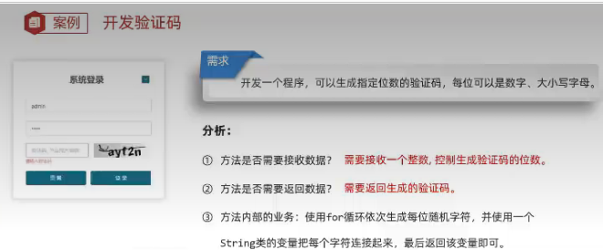
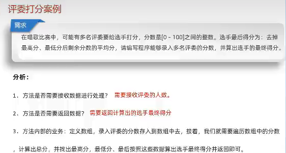
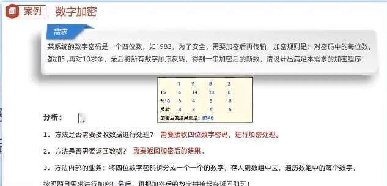
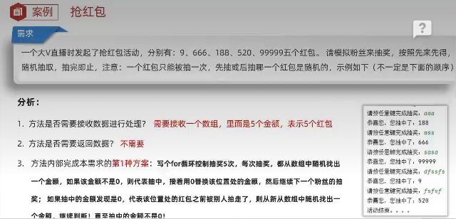
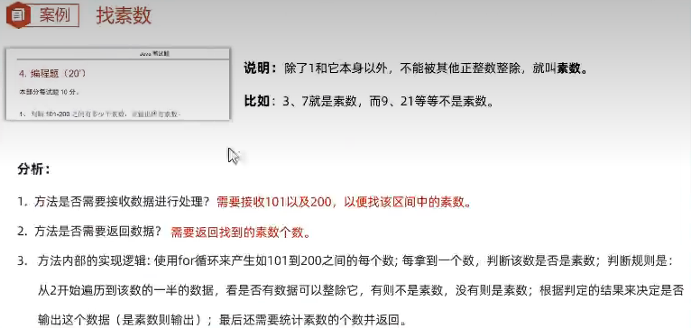
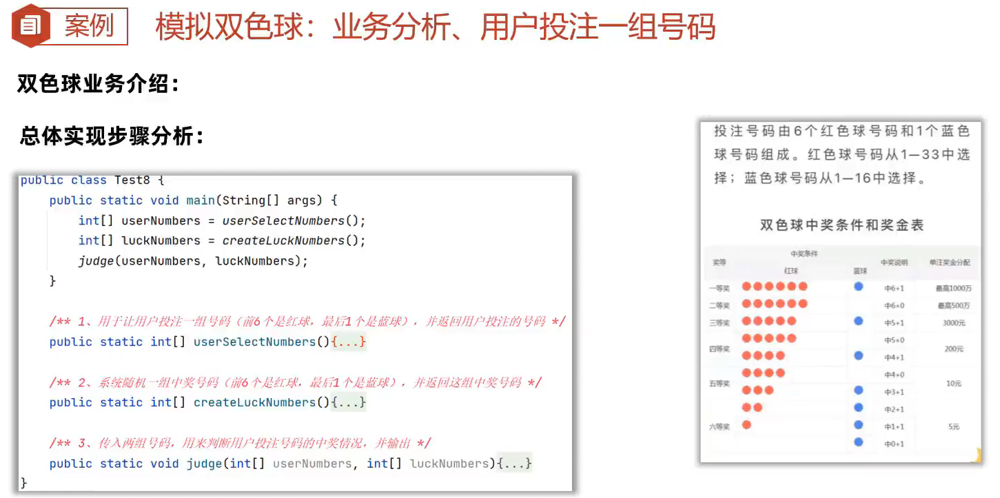

# 算法练习

## 简单

### demo1  求回文数

需求：求是否为回文数  
如果一个数是回文数，打印true 否则返回false  
解释：回文数指正序和倒序读都是一样的整数  

例如：121 是回文数，1234 不是回文数  

### demo2  求商余数

需求：给定俩个整数，被除数和除数  
将俩数相除，不能使用乘除法和%运算符  

得到商和余数  

### demo3 逢七过

规则：从任意一个数开始报数，当你要报的数字是包含7或者是7的倍数时都要说：过

需求：在控制台打印出1-100之间满足逢七过的数字

### demo4 求平方根

需求：键盘录入一个大于等于2的整数x，计算并返回x的平方根。

结果只保留整数部分，小数部分舍去

### demo5 求质数

需求：从键盘输入一个数，判断是否为质数

规则：一个整数只能被1和自身整除则就是质数

 例如：7 = 1 * 7      ，     8 = 1 * 8    2 * 4   合数

### demo6 猜数字

需求：随机生成一个1-100之间的数据，提示用户猜测，猜大提示过大，猜小提示过小，直到猜中结束游戏。

思路：1.先随机生成一个1-100之间的数据。2.定义一个死循环让用户可以一直猜 。3.在死循环里面提示用户过大过小。

### demo7 随机排序工号

需求：将员工工号按随机顺序输出

### demo8 买飞机票

需求：买飞机票 机票按照季节、头等舱、经济舱的情况进行优惠  
方案如下：5-10月为旺季，头等舱9折；11月到来年4月为淡季，头等舱7折、经济舱6.5折

### demo9 生成验证码



### demo10 评委打分



### demo11 数字加密



### demo12 数组拷贝


### demo13 抢红包



### demo14 找素数



### demo15 实现双色球



### demo16 找单独的数

```java
//在一个班级中，每位同学都拿到了一张卡片，上面有一个整数。
//有趣的是，除了一个数字之外，所有的数字都恰好出现了两次。
思路：对数组元素进行异或运算，最终保存出现一次的数
public class Main {
    public static int solution(int[] cards) {
        // Edit your code here
        int result = 0;
        for (int i = 0; i < cards.length; i++) {
            result ^= cards[i];
        }
        return result;
    }

    public static void main(String[] args) {
        // Add your test cases here

        System.out.println(solution(new int[]{1, 1, 2, 2, 3, 3, 4, 5, 5}) == 4);
        System.out.println(solution(new int[]{0, 1, 0, 1, 2}) == 2);
    }
} 
```

### demo17 超过阈值的最少操作数

```java
给你一个下标从 0 开始的整数数组 nums 和一个整数 k 。
一次操作中，你可以删除 nums 中的最小元素。
你需要使数组中的所有元素都大于或等于 k ，请你返回需要的 最少 操作次数。
思路：遍历数组，和 k 比较大小，返回比 k 小的元素的个数。
public class Solution {
    public int minOperations(int[] nums, int k) {
        int res = 0;
        for (int num : nums) {
            if (num < k) {
                res++;
            }
        }
        return res;
    }
}
```

### demo20 各位相加

```java
给定一个非负整数 num，反复将它的各位数字相加，直到结果为一位数，返回这个结果。
```

### demo21 验证回文串

给定一个字符串，验证它是否是回文串。只考虑字母和数字字符，忽略字母的大小写。

思路：

- 使用两个指针，一个从字符串开头向右移动，另一个从字符串末尾向左移动。

- 跳过非字母数字字符，比较指针所指的字符是否相等。

- 如果所有字符都匹配，则字符串是回文串。

### demo22 二进制求和

给你两个二进制字符串 a 和 b，返回它们的和，用二进制字符串表示。

思路：

- 从两个字符串的末尾开始逐位相加，同时处理进位。
- 使用一个变量 carry 来记录进位。
- 将每一位的结果拼接到结果字符串中。
- 最后如果还有进位，需要将进位拼接到结果中。

### demo23 x的平方根

实现 int sqrt(int x) 函数，计算并返回 x 的平方根，结果只保留整数部分。

思路：使用 **二分查找法** 来高效地找到平方根的整数部分

            初始化左边界 left=0，右边界right=x，计算mid*mid与x的大小

            若mid*mid<=x则说明mid可能是解，left更新为mid，反之

            最后返回right

### demo24 爬楼梯

假设你正在爬楼梯。需要 n 阶你才能到达楼顶。每次你可以爬1阶或2 阶。问：有多少种不同的方法可以爬到楼顶？

### demo25 合并两个有序数组

给你两个按 **非递减顺序** 排列的整数数组 nums1 和 nums2，另有两个整数m 和n，分别表示 nums1 和 nums2 中的元素数目。

请你将 nums2 合并到 nums1 中，使合并后的数组同样按 **非递减顺序** 排列

### demo26 2的幂次

判断一个数是否是 2 的幂

思路：2 的幂的最大特性是它能被 2整除，直到结果为 1

### demo27 Nim游戏

你和你的朋友一起玩 Nim 游戏：

- 桌子上有一堆石子。

- 你们轮流进行自己的回合，你作为先手。

- 每一回合，轮到的人可以拿走 1 到 3 颗石子。

- 拿走最后一颗石子的人获胜。

假设你们每一步都选择最优解，请编写一个函数来判断你是否可以赢得游戏。如果可以，返回 true；否则，返回 false。

思路：如果剩下的石子数量是 4 的倍数,那么当前玩家必输。否则，当前玩家可以通过拿取 1、2 或 3 颗石子，将剩下的石子数量变为 4 的倍数，从而迫使对手处于必输状态。

### demo28 丑数

丑数是指只包含质因数 2、3 和 5 的正整数。给定一个整数 n，请判断 n 是否为丑数。如果是，返回 true；否则，返回 false。

思路：将 `n` 分别除以 2、3 和 5，直到不能整除为止。

            如果最终剩下的数是 1，说明 n 只包含质因数 2、3 和 5，是丑数。

            否则，说明 n 包含其他质因数，不是丑数。

### demo29 存在重复元素

给定一个整数数组 nums，如果数组中至少有一个值出现至少两次，返回 true；如果数组中每个元素都互不相同，返回 false。

思路：创建哈希表，遍历数组，若当前元素已经存在哈希表，则说明存在相同的元素返回true，否则加入哈希表，遍历结束后没有发现重复元素返回false

    示例：
    输入: nums = [1,2,3,1]
    输出: true
    
    输入: nums = [1,2,3,4]
    输出: false
    
    输入: nums = [1,1,1,3,3,4,3,2,4,2]
    输出: true

### demo30 存在重复元素 II

给定一个整数数组 `nums` 和一个整数 `k`，判断数组中是否存在两个不同的索引 `i` 和 `j`，使得 `nums[i] == nums[j]` 且 `abs(i - j) <= k`。

思路：

- 使用一个哈希表来存储元素及其最近一次出现的下标。遍历数组，对于每个元素：

- 如果该元素已经存在于哈希表中，且当前下标与哈希表中存储的下标之差不超过 `k`，返回 `true`。否则，更新哈希表中该元素的下标为当前下标。如果遍历结束后没有找到满足条件的元素对，返回 `false`。

```java
输入: nums = [1,2,3,1], k = 3
输出: true
解释: nums[0] == nums[3]，且 3 - 0 <= 3。

输入: nums = [1,0,1,1], k = 1
输出: true
解释: nums[2] == nums[3]，且 3 - 2 <= 1。

输入: nums = [1,2,3,1,2,3], k = 2
输出: false
解释: 没有任何两个相同的元素的下标之差 <= 2。
```

### demo31汇总区间

给定一个 **无重复元素** 且 **有序** 的整数数组 `nums`，返回 **恰好覆盖数组中所有数字** 的 **最小有序区间范围列表**。也就是说，`nums` 的每个元素都恰好被某个区间覆盖，且不存在某个区间可以合并到另一个区间中。

区间范围用 `"a->b"` 表示，其中 `a` 是区间的起始值，`b` 是区间的结束值。如果区间只包含一个元素，则表示为 `"a"`。

思路：

- 使用两个指针 `start` 和 `end` 来表示当前区间的起始和结束位置。

- 遍历数组，检查当前元素是否与下一个元素连续，即 `nums[i] + 1 == nums[i + 1]`。

- 如果连续，则扩展当前区间；否则，结束当前区间，并将其添加到结果列表中。

- 只包含一个元素的表示为`”a“`，多个元素的表示为`”a->b“`。

```java
输入: nums = [0,1,2,4,5,7]
输出: ["0->2","4->5","7"]
解释: 
- 区间 "0->2" 覆盖了 [0,1,2]。
- 区间 "4->5" 覆盖了 [4,5]。
- 区间 "7" 覆盖了 [7]。
```

### demo32 丢失的数字

给定一个包含 `[0, n]` 范围内 `n` 个不同数字的数组 `nums`，其中 `n` 是数组的长度，请找出数组中缺失的那个数字。

思路：计算 `0-n` 的总和`sum`，数组元素的和`numsSum`,缺失的元素就是  `sum - numsSum`

```java
输入: nums = [3,0,1]
输出: 2
解释: 数组长度为 3，范围是 [0,3]，缺失的数字是 2。
```

### demo33 移动零

给定一个数组 `nums`，编写一个函数将所有 `0` 移动到数组的末尾，同时保持非零元素的相对顺序。

思路：

- 使用一个指针 `left` 指向当前非零元素应该存放的位置。

- 使用另一个指针 `right` 遍历数组。

- 当 `nums[right]` 不为 `0` 时，将其移动到 `nums[left]`，然后 `left` 右移。

- 遍历结束后，将 `left` 之后的所有元素置为 `0`。
  
  ```java
  输入: nums = [0,1,0,3,12]
  输出: [1,3,12,0,0]
  ```

### demo34 3的幂

给定一个整数 `n`，判断它是否是 3 的幂次方。如果是，返回 `true`；否则，返回 `false`。

### 27.移除元素

给你一个数组 `nums` 和一个值 `val`，你需要 **原地** 移除所有数值等于 `val` 的元素，并返回移除后数组的新长度。

```java
输入: nums = [3,2,2,3], val = 3
输出: 2, nums = [2,2]
```

### 28.实现strStr()

给你两个字符串 `haystack` 和 `needle`，请你在 `haystack` 字符串中找出 `needle` 字符串的第一个匹配项的下标（下标从 0 开始）。如果 `needle` 不是 `haystack` 的一部分，则返回 `-1`。

思路：

- 遍历 `haystack` 字符串，从每个字符开始尝试匹配 `needle`。

- 如果匹配成功，返回当前下标；否则继续遍历。

- 如果遍历结束仍未找到匹配项，返回 `-1`。
  
  ```java
  输入: haystack = "hello", needle = "ll"
  输出: 2
  输入: haystack = "aaaaa", needle = "bba"
  输出: -1
  ```

### 53.最大子序和

给定一个整数数组 `nums`，找到一个具有最大和的连续子数组（子数组最少包含一个元素），返回其最大和。

思路：

- 使用两层循环，外层循环枚举子数组的起始位置，内层循环枚举子数组的结束位置。

- 计算每个子数组的和，并记录最大值。
  
  ```java
  输入: nums = [-2,1,-3,4,-1,2,1,-5,4]
  输出: 6
  解释: 连续子数组 [4,-1,2,1] 的和最大，为 6。
  ```

### 58.最后一个单词的长度

给你一个字符串 `s`，由若干单词组成，单词之间用空格隔开。返回字符串中 **最后一个单词的长度**。如果不存在最后一个单词，请返回 `0`。

```java

```

### 121 买卖股票的最佳时机

给定一个数组 `prices`，其中 `prices[i]` 是第 `i` 天的股票价格。你只能进行一次交易（即买入一次和卖出一次），设计一个算法来计算你所能获取的最大利润。

```java

```

### 15 三数之和

给你一个整数数组 `nums`，判断是否存在三元组 `[nums[i], nums[j], nums[k]]` 满足 `i != j`、`i != k` 且 `j != k`，同时还满足 `nums[i] + nums[j] + nums[k] == 0`。请你返回所有满足条件且不重复的三元组。

思路：

- 使用三重循环枚举所有可能的三元组 `(i, j, k)`，并检查是否满足 `nums[i] + nums[j] + nums[k] == 0`。
- 将满足条件的三元组排序后存入 `Set`，利用 `Set` 的特性自动去重。
- 将 `Set` 转换为 `List` 并返回。

```java
输入：int[] nums = {-1, 0, 1, 2, -1, -4};
输出： [[-1, -1, 2], [-1, 0, 1]]
```

### 17 电话号码的字母组合

要求给定一个仅包含数字 `2-9` 的字符串，返回所有可能的字母组合。数字到字母的映射与电话按键相同。

思路：

1. 初始化一个结果列表，最开始放入一个空字符串。
2. 遍历输入的数字字符串，对于每个数字，获取其对应的字母。
3. 将当前结果列表中的每个字符串与当前数字对应的字母逐个组合，形成新的结果。
4. 更新结果列表，继续处理下一个数字。

```ja

```

### 75 颜色分类

给定一个包含 `n` 个元素的数组 `nums`，其中每个元素是 `0`、`1` 或 `2`，分别表示红色、白色和蓝色。请原地对数组进行排序，使得相同颜色的元素相邻，并按照红色、白色、蓝色的顺序排列。

思路：

```java
left：指向 `0` 的右边界（初始在最左边）。

right：指向 `2` 的左边界（初始在最右边）。

current：当前遍历的指针（初始在最左边）。

如果当前数是 0，把它扔到left的位置，然后left和current都往右移动。

如果当前数是 2，把它扔到right的位置，然后right往左移动（注意current不动，
因为交换过来的数可能是0或1，需要再检查）。

如果当前数是 1，直接跳过，current往右移动。
```

### 94 二叉树的中序遍历

实现二叉树的中序遍历:

1. 定义一个 `inorder` 辅助函数，用于递归遍历二叉树。

2. 如果当前节点为空，直接返回。

3. 先递归遍历左子树，然后访问根节点，最后递归遍历右子树。

4. 将遍历结果存储在 `result` 列表中。
