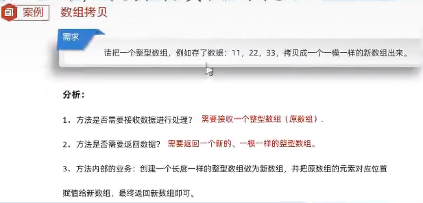

# 算法练习

## 简单

### demo1  求回文数

需求：求是否为回文数  
如果一个数是回文数，打印true 否则返回false  
解释：回文数指正序和倒序读都是一样的整数  

例如：121 是回文数，1234 不是回文数  

### demo2  求商余数

需求：给定俩个整数，被除数和除数  
将俩数相除，不能使用乘除法和%运算符  

得到商和余数  

### demo3 逢七过

规则：从任意一个数开始报数，当你要报的数字是包含7或者是7的倍数时都要说：过

需求：在控制台打印出1-100之间满足逢七过的数字

### demo4 求平方根

需求：键盘录入一个大于等于2的整数x，计算并返回x的平方根。

结果只保留整数部分，小数部分舍去

### demo5 求质数

需求：从键盘输入一个数，判断是否为质数

规则：一个整数只能被1和自身整除则就是质数

 例如：7 = 1 * 7      ，     8 = 1 * 8    2 * 4   合数

### demo6 猜数字

需求：随机生成一个1-100之间的数据，提示用户猜测，猜大提示过大，猜小提示过小，直到猜中结束游戏。

思路：1.先随机生成一个1-100之间的数据。2.定义一个死循环让用户可以一直猜 。3.在死循环里面提示用户过大过小。

### demo7 随机顺序工号

需求：将员工工号按随机顺序输出

### demo8 买飞机票

需求：买飞机票 机票按照季节、头等舱、经济舱的情况进行优惠  
方案如下：5-10月为旺季，头等舱9折；11月到来年4月为淡季，头等舱7折、经济舱6.5折

### demo9 生成验证码

### demo10 评委打分

### demo11 数字加密

### demo12 数组拷贝

### demo13

## 中等

## 困难
